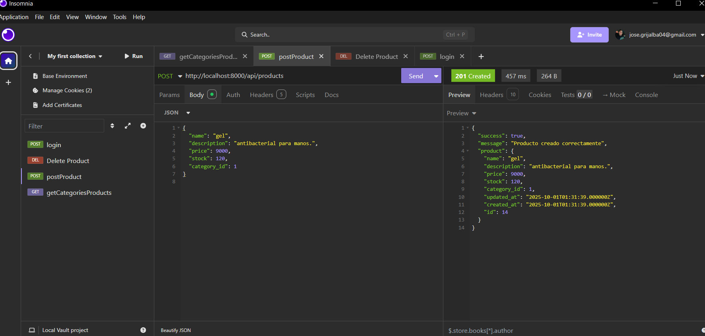
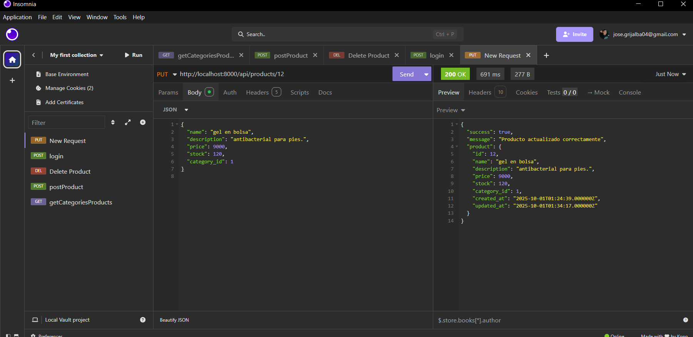
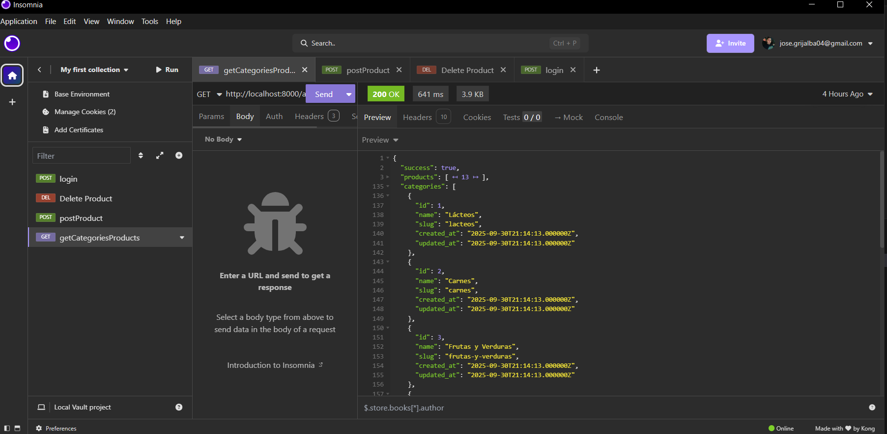
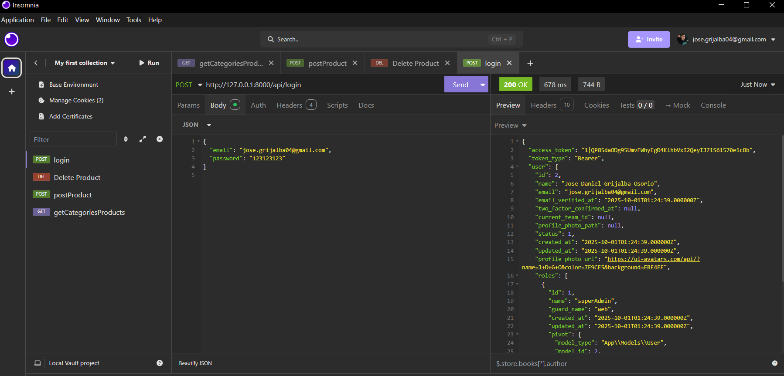

## Casa Editorial El Tiempo - PRUEBA TECNICA Michael page

- se realizo el crud en api de productos solicitado, tablas elaboradas en ingles
  se puedieron anadir mas caracteristicas, solo decidi seguir lo establecido.
  el proyecto cuenta con spatie para roles y permisos, solo que no esta applicado. 
  el rol es admin.

- http://127.0.0.1:8000/api/login
  las creadeciales son jose.grijalba04@gmail.com y admin@email.com
- contrasena: 123123123 # solo es para pruebas
- anexo screenshoots de las pruebas realizadas en images/
  
## Comandos a ejecutar en la ubicacion del proyecto BAKEND 

```bash
npm install
composer install
cp .env.example .env
php artisan key:generate 
php artisan migrate 
php artisan serve
npm run dev
```
- Nota: ajunto de igual forma la bd en el proyecto
### RUTAS API
# Productos (ejemplo)
- Nota para crear productos tiene que estas autenticado
- se han usado middlewares para evitar acceso indevido como forma de seguriadad
  
- GET    http://127.0.0.1:8000/api/products
- POST   http://127.0.0.1:8000/api/products
- PUT    http://127.0.0.1:8000/api/products/{id}
- DELETE http://127.0.0.1:8000/api/products/{id}

# Para realizar las pruebas unitarias ejecutar
php artisan test --filter=ProductTest

## Descripción del Proyecto

Esta aplicación web moderna utiliza Laravel como API REST backend y Angular como frontend SPA, proporcionando una experiencia de usuario fluida y dinámica sin recargas de página.

## Características Principales

- Single Page Application (SPA) - Navegación sin recargas  
- Autenticación JWT - Sistema seguro de login  
- Responsive Design - Adaptable a todos los dispositivos  
- API RESTful - Comunicación eficiente backend-frontend  
- UI/UX Moderna - Interfaz intuitiva y atractiva  
- Actualizaciones en tiempo real  
- Dashboard dinámico con métricas y visualizaciones interactivas  

## Backend (Laravel)

- Framework: Laravel 11.x  
- PHP: 8.2+  
- Base de datos: MySQL 8.0+  
- Validación: Form Requests  
- ORM: Eloquent  

## Frontend (Angular)

- Framework: Angular 17+  
- Lenguaje: TypeScript 5.x  
- UI Framework: Angular Material / Bootstrap  
- Routing: Angular Router con guards  

## Herramientas de Desarrollo

- Control de versiones: Git  
- API Testing: Postman / Insomnia  
- Database Management: phpMyAdmin / MySQL Workbench  

## Instalación y Configuración

### Prerrequisitos

- PHP 8.2+  
- Composer  
- Node.js 18+  
- npm  
- MySQL 8.0+  
- Git  

## Estructura del Proyecto

```
┌──────────────────────────────────────────────────────┐
│                    FRONTEND (Angular)                │
│  ┌─────────────┐  ┌─────────────┐  ┌─────────────┐   │
│  │ Components  │  │  Services   │  │   Guards    │   │
│  └─────────────┘  └─────────────┘  └─────────────┘   │
│  ┌─────────────┐  ┌─────────────┐  ┌─────────────┐   │
│  │   Routing   │  │ HTTP Client │  │ Interceptors│   │
│  └─────────────┘  └─────────────┘  └─────────────┘   │
└─────────────────────┬────────────────────────────────┘
                      │ HTTP Requests (JSON)
                      │
┌─────────────────────▼────────────────────────────────┐
│                  BACKEND (Laravel)                   │
│  ┌─────────────┐  ┌─────────────┐  ┌─────────────┐   │
│  │ Controllers │  │   Models    │  │ Migrations  │   │
│  └─────────────┘  └─────────────┘  └─────────────┘   │
│  ┌─────────────┐  ┌─────────────┐  ┌─────────────┐   │
│  │ Middleware  │  │   Routes    │  │   Policies  │   │
│  └─────────────┘  └─────────────┘  └─────────────┘   │
└─────────────────────┬────────────────────────────────┘
                      │
                      ▼
                 ┌─────────────┐
                 │   Database  │
                 │  (MySQL)    │
                 └─────────────┘
```

## Autor

**José Daniel Grijalba Osorio**  
Email: jose.grijalba04@gmail.com  
LinkedIn: [linkedin.com/in/jose-daniel-go](https://www.linkedin.com/in/jose-daniel-go)  
GitHub: [github.com/Jose-Daniel-G](https://github.com/Jose-Daniel-G)

|     TESTING IMAGES        |             API           |
|--------------------------|---------------------------|
|||
|||

images/delete-product.png